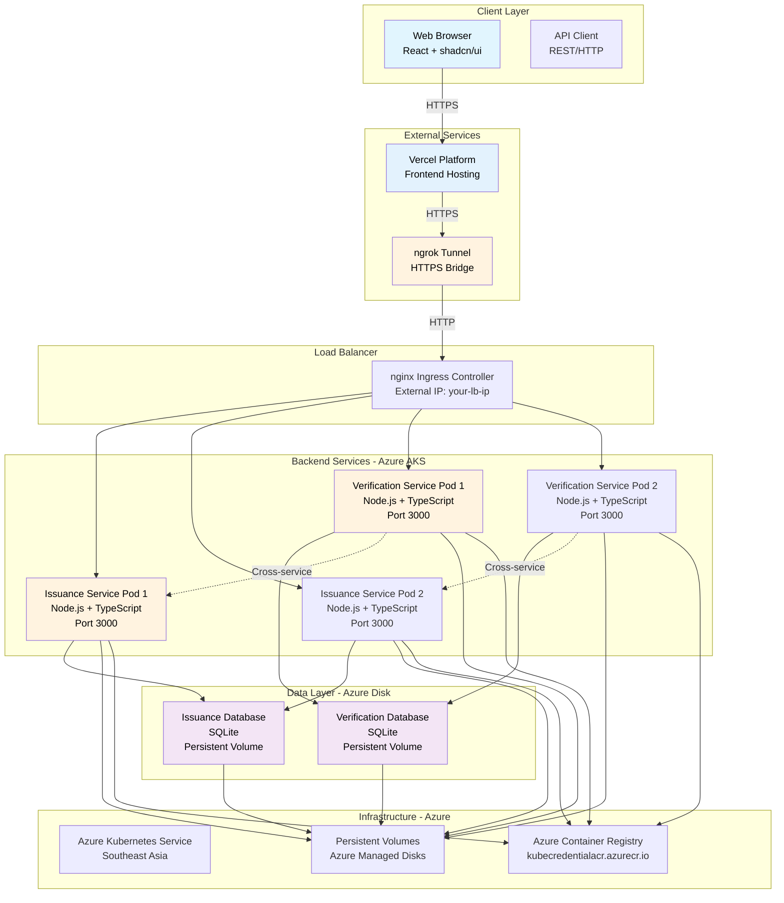
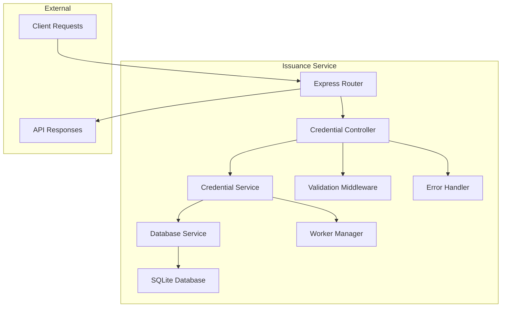
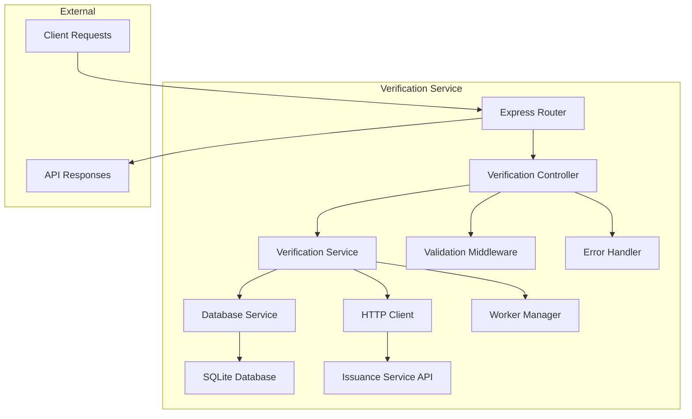
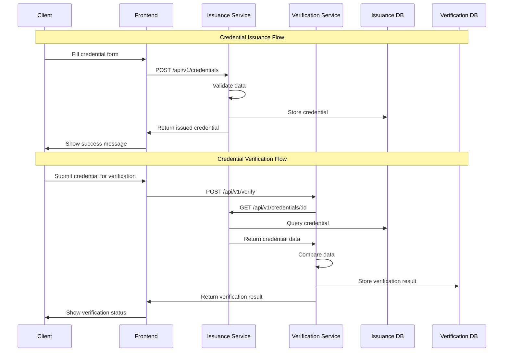
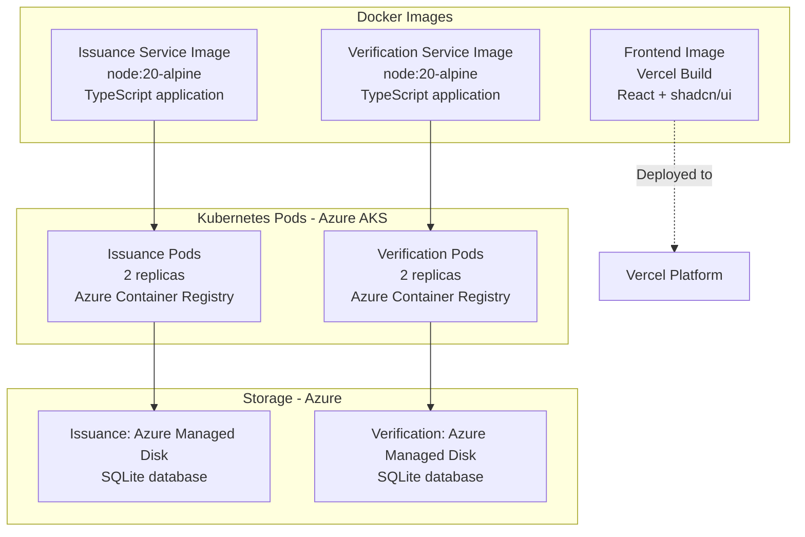
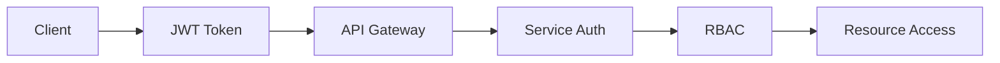
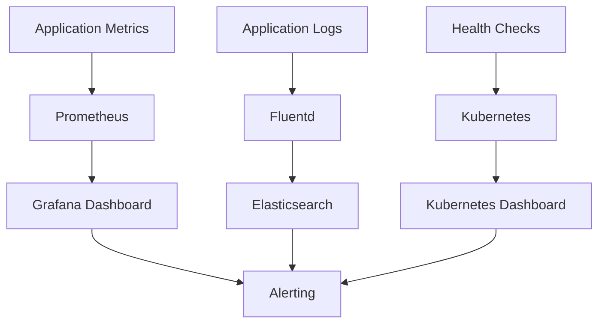
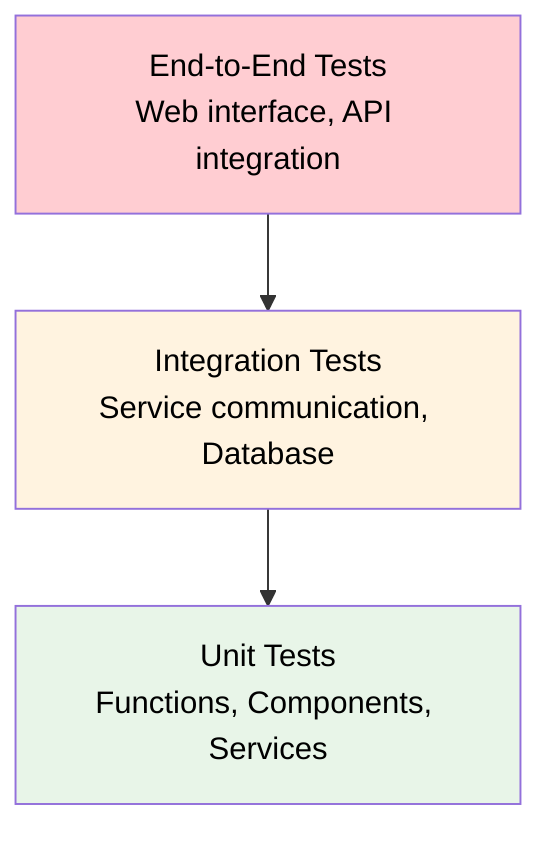
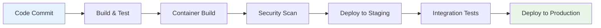

# 🏗️ Kube Credential - System Architecture Documentation

## Overview

**Kube Credential** is a cloud-native, microservice-based credential management system designed for enterprise-scale digital credential issuance and verification. Built with modern technologies and best practices, it demonstrates production-ready software engineering.

---

## 🎯 Architecture Principles

### Design Patterns
- **Microservices Architecture**: Independent, loosely coupled services
- **Clean Architecture**: Layered approach with clear separation of concerns
- **Event-Driven**: Asynchronous communication between services
- **Container-First**: Designed for cloud-native deployment

### Quality Attributes
- **Scalability**: Horizontal scaling with Kubernetes
- **Reliability**: Health checks, graceful error handling
- **Maintainability**: TypeScript, modular code, comprehensive testing
- **Security**: Input validation, CORS, security headers
- **Performance**: Optimized builds, efficient resource usage

---

## 🏗️ System Architecture



---

## 🔧 Technology Stack

### Frontend
- **Framework**: React 18 with TypeScript
- **UI Library**: shadcn/ui components
- **Styling**: Tailwind CSS
- **Build Tool**: Vite
- **Routing**: React Router DOM
- **HTTP Client**: Fetch API

### Backend
- **Runtime**: Node.js 20
- **Language**: TypeScript (strict mode)
- **Framework**: Express.js
- **Database**: SQLite with better-sqlite3
- **Validation**: Custom validation middleware
- **Security**: Helmet.js, CORS
- **Logging**: Morgan + custom structured logging

### Infrastructure
- **Containerization**: Docker with multi-stage builds
- **Orchestration**: Azure Kubernetes Service (AKS)
- **Container Registry**: Azure Container Registry (ACR)
- **Service Mesh**: Kubernetes native service discovery
- **Load Balancing**: nginx ingress controller
- **Storage**: Azure Managed Disks (Persistent Volumes)
- **Monitoring**: Kubernetes health checks
- **External Access**: ngrok HTTPS tunnel (development/demo)

### Development & Testing
- **Testing Framework**: Jest + Supertest
- **Code Quality**: ESLint + Prettier
- **Type Checking**: TypeScript strict mode
- **Build System**: npm/yarn workspaces
- **CI/CD Ready**: Docker-based pipeline

---

## 📊 Service Architecture

### Issuance Service



**Responsibilities:**
- Issue new digital credentials
- Store credential data securely
- Validate credential format and data
- Generate unique worker identifiers
- Provide credential retrieval APIs

**API Endpoints:**
- `POST /api/v1/credentials` - Issue new credential
- `GET /api/v1/credentials` - List all credentials
- `GET /api/v1/credentials/:id` - Get specific credential
- `GET /api/v1/health` - Health check
- `GET /api/v1/worker` - Worker information

### Verification Service



**Responsibilities:**
- Verify credential authenticity
- Cross-reference with issuance service
- Store verification audit trail
- Detect tampered or invalid credentials
- Provide verification history

**API Endpoints:**
- `POST /api/v1/verify` - Verify credential
- `GET /api/v1/history` - Verification history
- `GET /api/v1/health` - Health check
- `GET /api/v1/worker` - Worker information

---

## 💾 Data Architecture

### Database Schema

#### Credentials Table (Issuance Service)
```sql
CREATE TABLE credentials (
    id TEXT PRIMARY KEY,
    holderName TEXT NOT NULL,
    credentialType TEXT NOT NULL,
    issueDate TEXT NOT NULL,
    expiryDate TEXT,
    issuerName TEXT NOT NULL,
    data TEXT NOT NULL, -- JSON string
    issuedBy TEXT NOT NULL,
    timestamp TEXT NOT NULL
);
```

#### Verifications Table (Verification Service)
```sql
CREATE TABLE verifications (
    id INTEGER PRIMARY KEY AUTOINCREMENT,
    credentialId TEXT,
    isValid BOOLEAN NOT NULL,
    verifiedBy TEXT NOT NULL,
    timestamp TEXT NOT NULL,
    details TEXT -- JSON string
);
```

### Data Flow



---

## 🚀 Deployment Architecture

### Kubernetes Resources

#### Namespace
```yaml
apiVersion: v1
kind: Namespace
metadata:
  name: kube-credential
```

#### Deployments
- **Frontend**: 2 replicas, nginx serving React app
- **Issuance Service**: 2 replicas, Node.js application
- **Verification Service**: 2 replicas, Node.js application

#### Services
- **ClusterIP Services**: Internal communication
- **Ingress**: External access via nginx controller

#### Persistent Storage
- **PVC**: 1Gi volumes for each database
- **Storage Class**: Azure Managed Disks (default)

### Container Architecture



---

## 🔒 Security Architecture

### Security Layers

1. **Network Security**
   - Kubernetes network policies ready
   - CORS configuration
   - Helmet.js security headers

2. **Application Security**
   - Input validation and sanitization
   - SQL injection prevention (parameterized queries)
   - Error message sanitization

3. **Container Security**
   - Non-root user execution
   - Minimal base images (Alpine Linux)
   - No sensitive data in images

4. **Data Security**
   - At-rest encryption ready (volume encryption)
   - In-transit encryption (HTTPS/TLS)
   - Structured logging (no sensitive data)

### Authentication & Authorization (Production Ready)


---

## 📈 Scalability & Performance

### Horizontal Scaling
- **Stateless Services**: All services designed stateless
- **Database Scaling**: SQLite for dev, PostgreSQL for production
- **Load Balancing**: Kubernetes native load balancing
- **Auto-scaling**: HPA ready for production

### Performance Optimizations
- **Frontend**: Vite bundling, code splitting
- **Backend**: Connection pooling, response compression
- **Database**: Indexed queries, connection reuse
- **Infrastructure**: Resource limits, health checks

### Monitoring & Observability


---

## 🧪 Testing Strategy

### Testing Pyramid



### Test Categories

1. **Unit Tests** (Jest + Supertest)
   - Service layer functions
   - Controller logic
   - Validation functions
   - Database operations

2. **Integration Tests**
   - API endpoint testing
   - Database connectivity
   - Cross-service communication

3. **End-to-End Tests**
   - Web interface workflows
   - Complete user journeys
   - Performance testing

---

## 🔄 CI/CD Pipeline (Production Ready)



### Pipeline Stages
1. **Source**: Git repository triggers
2. **Build**: TypeScript compilation, React build
3. **Test**: Unit tests, integration tests
4. **Package**: Docker image creation
5. **Security**: Container vulnerability scanning
6. **Deploy**: Kubernetes deployment
7. **Verify**: Health checks, smoke tests

---

## 📋 Production Readiness Checklist

### ✅ Completed
- [x] Microservice architecture
- [x] TypeScript strict mode
- [x] Comprehensive error handling
- [x] Health check endpoints
- [x] Kubernetes deployment
- [x] Persistent storage
- [x] Load balancing
- [x] Container optimization
- [x] Testing framework
- [x] Documentation

### 🔧 Production Enhancements
- [ ] JWT authentication
- [ ] Rate limiting
- [ ] Distributed tracing
- [ ] Metrics collection
- [ ] Log aggregation
- [ ] Auto-scaling
- [ ] Backup strategy
- [ ] Disaster recovery

---

## 📊 System Metrics

### Performance Targets
- **Response Time**: < 100ms (95th percentile)
- **Throughput**: 1000+ requests/second
- **Availability**: 99.9% uptime
- **Recovery Time**: < 30 seconds

### Resource Requirements
- **CPU**: 100-500m per pod
- **Memory**: 128-512Mi per pod
- **Storage**: 1-10Gi per database
- **Network**: < 100MB/s inter-service

---

*This architecture documentation provides a comprehensive overview of the Kube Credential system design, implementation, and deployment strategy.*