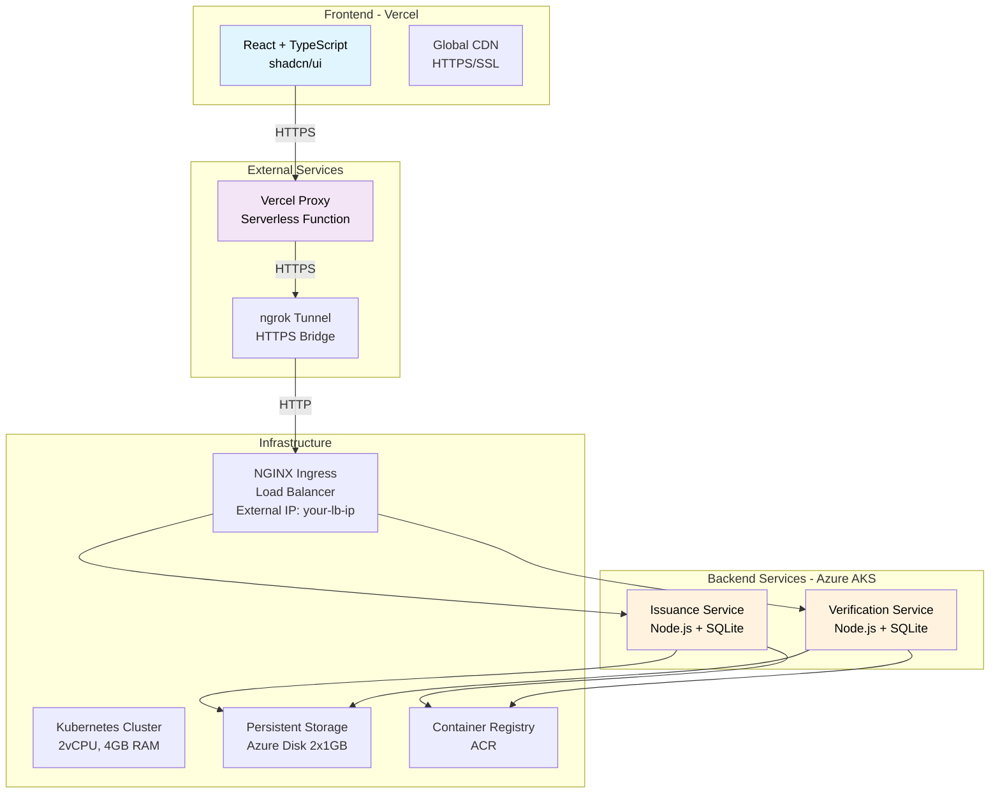

# 🎯 Kube Credential - Full Stack Engineer Assessment

> **A production-ready microservice-based credential management system deployed on Azure Kubernetes Service with modern cloud-native architecture.**

[](https://kubernetes.io/)
[](https://azure.microsoft.com/)
[](https://www.typescriptlang.org/)
[](https://reactjs.org/)
[](https://vercel.com/)

## 👤 Candidate Information

**Name:** Sourav Budke  
**Email:** [souravbudke@gmail.com](mailto:souravbudke@gmail.com)  
**GitHub:** https://github.com/Souravbudke/kube-credential

## 🌐 Live Demo

- **Frontend (Vercel):** https://kubecredential.vercel.app/
- **Backend (Azure AKS):** Running on Azure Kubernetes Service (Southeast Asia)
- **Health Check:** https://kubecredential.vercel.app/health

## 🌟 Quick Start

```bash
# Access the live application
open https://kubecredential.vercel.app/

# Or deploy to your own Azure account
cd k8s
./deploy-azure.sh
```

---

## 🏗️ System Architecture



## 🚀 Features Demonstrated

### ✅ **Microservice Architecture**
- **Independent Services**: Issuance and Verification services
- **Service Discovery**: Kubernetes-native DNS resolution
- **Load Balancing**: Multiple replicas with automatic load distribution
- **Cross-Service Communication**: REST API calls between services

### ✅ **Modern Technology Stack**
- **Frontend**: React 18 + TypeScript + Vite + shadcn/ui + Tailwind CSS
- **Backend**: Node.js 18 + TypeScript + Express.js + SQLite
- **Cloud**: Azure Kubernetes Service (AKS) + Vercel + ngrok
- **Infrastructure**: Docker + Kubernetes 1.32 + NGINX Ingress + Azure Container Registry
- **Development**: Vite + Jest + ESLint + Prettier

### ✅ **Production-Ready Deployment**
- **Containerization**: Multi-stage Docker builds
- **Orchestration**: Kubernetes with high availability
- **Storage**: Persistent volumes for data durability
- **Security**: CORS, Helmet.js, input validation
- **Monitoring**: Health checks and structured logging

### ✅ **Comprehensive Testing**
- **Unit Tests**: Jest framework for service logic
- **Integration Tests**: API endpoint testing
- **End-to-End Tests**: Full workflow validation
- **Performance Tests**: Response time and load testing

---

## 📁 Project Structure

```
kube-credential/
├── 📱 frontend/                 # React TypeScript UI (Deployed on Vercel)
│   ├── src/
│   │   ├── components/ui/       # shadcn/ui components
│   │   ├── pages/              # Issue, Verify, Health pages
│   │   ├── services/           # API client
│   │   └── lib/                # Utilities
│   ├── api/
│   │   └── proxy.js            # Vercel serverless proxy
│   └── vercel.json             # Vercel configuration
│
├── 🔧 services/                # Backend microservices (Azure AKS)
│   ├── issuance-service/       # Credential issuance API
│   │   ├── src/
│   │   │   ├── controllers/    # Request handlers
│   │   │   ├── services/       # Business logic
│   │   │   ├── database/       # SQLite persistence
│   │   │   └── __tests__/      # Unit tests
│   │   └── Dockerfile          # Multi-stage build
│   │
│   └── verification-service/   # Credential verification API
│       ├── src/
│       │   ├── controllers/    # Request handlers
│       │   ├── services/       # Business logic
│       │   ├── database/       # SQLite persistence
│       │   └── __tests__/      # Unit tests
│       └── Dockerfile          # Multi-stage build
│
├── ☸️ k8s/                     # Kubernetes manifests (Azure AKS)
│   ├── namespace.yaml          # kube-credential namespace
│   ├── configmap.yaml          # Environment configuration
│   ├── persistent-volumes.yaml # SQLite storage (Azure Disk)
│   ├── issuance-service.yaml   # Deployment + Service
│   ├── verification-service.yaml # Deployment + Service
│   ├── ingress.yaml            # NGINX ingress routing
│   ├── deploy-azure.sh         # Azure deployment script
│   └── cleanup-azure.sh        # Cleanup script
│
├── 📚 Documentation
│   ├── README.md               # This file
│   ├── ARCHITECTURE.md         # Detailed architecture
│   └── docker-compose.yml      # Local development
│
└── 🔧 Configuration
    └── .gitignore              # Git ignore rules
```

---

## 🧪 Testing & Validation

### **Unit Tests**
```bash
# Run backend tests
cd services/issuance-service && npm test
cd services/verification-service && npm test

# Test coverage
npm run test:coverage
```

### **Manual Testing Workflows**

#### 1. **Web Interface Testing**
- Visit https://kubecredential.vercel.app/
- Navigate to **Issue Credential** page
- Fill in credential details and submit
- Note the worker ID in the response: `"credential issued by worker-{id}"`
- Navigate to **Verify Credential** page
- Enter the same credential details
- Verify the credential is found with worker info
- Check **Service Health** page for system status

#### 2. **API Testing (via ngrok)**
```bash
# Test credential issuance
curl -X POST https://your-ngrok-url.ngrok-free.app/issuance/api/v1/credentials \
  -H "Content-Type: application/json" \
  -H "ngrok-skip-browser-warning: true" \
  -d '{
    "id": "test-123",
    "holderName": "John Doe",
    "issuerName": "Test University",
    "credentialType": "Degree",
    "issueDate": "2024-01-01"
  }'

# Test credential verification
curl -X POST https://your-ngrok-url.ngrok-free.app/verification/api/v1/verify \
  -H "Content-Type: application/json" \
  -H "ngrok-skip-browser-warning: true" \
  -d '{
    "id": "test-123",
    "holderName": "John Doe",
    "issuerName": "Test University",
    "credentialType": "Degree",
    "issueDate": "2024-01-01"
  }'
```

#### 3. **Azure AKS Validation**
```bash
# Check cluster status
az aks show --resource-group kube-credential-rg --name kube-credential-cluster

# Check pods
kubectl get pods -n kube-credential

# Check services
kubectl get svc -n kube-credential

# View logs
kubectl logs -n kube-credential -l app=issuance-service --tail=50

# Verify data persistence
kubectl exec -it -n kube-credential \
  $(kubectl get pods -n kube-credential -l app=issuance-service -o jsonpath='{.items[0].metadata.name}') \
  -- sqlite3 /app/data/credentials.db "SELECT COUNT(*) FROM credentials;"
```

---

## 📈 Performance & Resources

### **Azure AKS Cluster**
- **Region**: Southeast Asia (Singapore)
- **Node**: 1 x Standard_B2s (2 vCPU, 4GB RAM)
- **Kubernetes Version**: 1.32
- **Container Registry**: kubecredentialacr.azurecr.io

### **Running Services**
- **Issuance Service**: 2 replicas
- **Verification Service**: 2 replicas
- **NGINX Ingress**: 1 replica with LoadBalancer
- **Persistent Storage**: 2 x 1GB Azure Managed Disks

### **Resource Allocation**
- 💾 **Memory**: 128-256Mi per pod
- ⚙️ **CPU**: 100-200m per pod
- 💿 **Storage**: 1Gi persistent volumes (SQLite databases)
- 🌐 **Network**: ClusterIP services + Ingress

---

## 🛡️ Security Features

### **Application Security**
- ✅ Input validation and sanitization
- ✅ SQL injection prevention
- ✅ CORS configuration
- ✅ Security headers (Helmet.js)
- ✅ Error message sanitization

### **Infrastructure Security**
- ✅ Container security (non-root users)
- ✅ Network isolation (Kubernetes namespaces)
- ✅ Secrets management ready
- ✅ TLS/HTTPS ready for production

---

## 🌐 Deployment Guide

### **Azure AKS Deployment** (Current Production)
```bash
# Prerequisites
az login
az account set --subscription "Azure for Students"

# Deploy to Azure
cd k8s
./deploy-azure.sh

# Cleanup
./cleanup-azure.sh
```

### **Local Development**
```bash
# Start services locally with Docker Compose
docker-compose up -d

# Or run services individually
cd services/issuance-service && npm run dev
cd services/verification-service && npm run dev
cd frontend && npm run dev
```

### **Vercel Frontend Deployment**
```bash
# Install Vercel CLI
npm i -g vercel

# Deploy frontend
cd frontend
vercel --prod

# Set environment variables in Vercel dashboard:
# VITE_ISSUANCE_API_URL=/api/proxy?service=issuance&path=/api/v1
# VITE_VERIFICATION_API_URL=/api/proxy?service=verification&path=/api/v1
```

---

## 📚 Documentation

| Document | Description |
|----------|-------------|
| **[README.md](README.md)** | This file - complete project overview |
| **[ARCHITECTURE.md](ARCHITECTURE.md)** | Detailed system architecture and design decisions |
| **[k8s/README.md](k8s/README.md)** | Kubernetes deployment guide |
| **[API Documentation](#-api-reference)** | Complete endpoint specifications |

---

## 🎯 API Reference

### **Issuance Service** 
**Base URL:** `https://your-ngrok-url.ngrok-free.app/issuance/api/v1`

| Method | Endpoint | Description | Response |
|--------|----------|-------------|----------|
| `POST` | `/credentials` | Issue new credential | Returns credential with `issuedBy: "worker-{id}"` |
| `GET` | `/credentials` | List all credentials | Array of issued credentials |
| `GET` | `/credentials/:id` | Get specific credential | Single credential or 404 |
| `GET` | `/health` | Service health check | Service status + worker info |
| `GET` | `/worker` | Worker information | Worker ID, hostname, timestamp |

**Example Response (Issue Credential):**
```json
{
  "success": true,
  "message": "credential issued by worker-issuance-service-796687cb67-hwn4z-6-h3zsd1",
  "data": {
    "credential": {
      "id": "test-123",
      "holderName": "John Doe",
      "issuerName": "Test University",
      "credentialType": "Degree",
      "issueDate": "2024-01-01",
      "issuedBy": "worker-issuance-service-796687cb67-hwn4z-6-h3zsd1",
      "timestamp": "2024-01-15T10:30:00.000Z"
    }
  }
}
```

### **Verification Service**
**Base URL:** `https://your-ngrok-url.ngrok-free.app/verification/api/v1`

| Method | Endpoint | Description | Response |
|--------|----------|-------------|----------|
| `POST` | `/verify` | Verify credential | Verification result with worker info |
| `GET` | `/history` | Verification history | Array of verification attempts |
| `GET` | `/health` | Service health check | Service status + worker info |
| `GET` | `/worker` | Worker information | Worker ID, hostname, timestamp |

---

## 🔧 Development Setup

### **Prerequisites**
- Node.js 18+
- Docker & Docker Compose
- Azure CLI (for cloud deployment)
- kubectl (for Kubernetes)
- ngrok (for HTTPS tunnel)

### **Local Development**
```bash
# 1. Clone repository
git clone https://github.com/Souravbudke/kube-credential.git
cd kube-credential

# 2. Install dependencies
cd frontend && npm install
cd ../services/issuance-service && npm install
cd ../services/verification-service && npm install

# 3. Start with Docker Compose
docker-compose up -d

# 4. Or run services individually
# Terminal 1: Issuance Service
cd services/issuance-service && npm run dev

# Terminal 2: Verification Service
cd services/verification-service && npm run dev

# Terminal 3: Frontend
cd frontend && npm run dev

# Access at http://localhost:5173
```

---

**🌐 Live Demo:** https://kubecredential.vercel.app/

---

*Built with ❤️ using Azure, Kubernetes, React, and TypeScript*